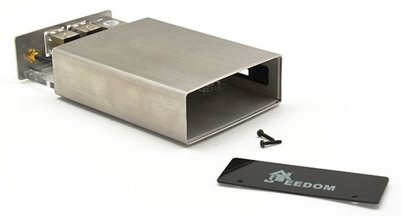
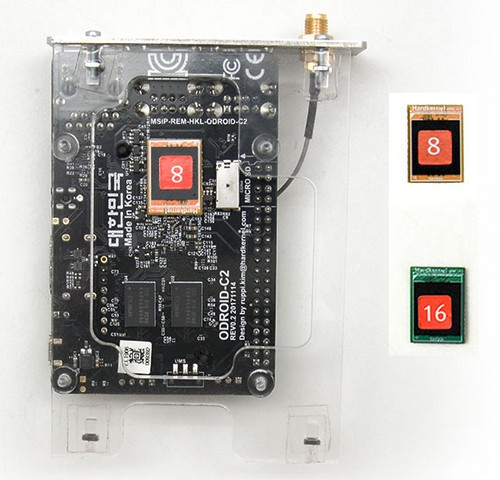

# Jeedom Smart Systemwiederherstellung

## Jeedom-Backup

Erstens, **Es ist wichtig, ein Backup von Jeedom zu erstellen** die am Ende des Verfahrens wiederhergestellt werden kann.

1. Gehen Sie zur Jeedom-Benutzeroberfläche und klicken Sie dann auf das Menü **Einstellungen > System > Backups**.

2. Klicken Sie auf die Schaltfläche **Starten Sie ein Backup**.

3. Wenn die Sicherung abgeschlossen ist, klicken Sie auf **Backup herunterladen**.

4. Sobald das Jeedom-Backup heruntergeladen wurde, schalten Sie das System über das Menü aus **Einstellungen > System > Ausschalten**.

## Systemwiederherstellung durch eMMC

Im folgenden Verfahren wird erläutert, wie Sie die Systemumgebung der Jeedom Smart-Box aktualisieren **Debian 11 Bullseye**.

>**Wichtig**
>
>Die Systemwiederherstellung per USB-Stick konnte in dieser neuen Umgebung nicht aufrechterhalten werden, daher ist es notwendig, das interne Speichermedium direkt zu brennen *(eMMC)* indem Sie die folgenden Schritte ausführen.
>
>**Bevor Sie beginnen, schauen Sie sich unbedingt das eMMC-Austauschvideo an, in dem die Demontage und der erneute Zusammenbau der Jeedom Smart-Box detailliert beschrieben werden** *(2 Minuten)* :
>
>{:target="_blank"}

### Voraussetzungen

Um das System zu aktualisieren, müssen Sie :

- Rüsten Sie sich aus mit'**ein kleiner Kreuzschlitzschraubendreher** um die Kiste zu öffnen

---

- Erwerben [**eine Ersatz-eMMC-Karte**](https://www.domadoo.fr/fr/controleurs-adaptateurs/5539-jeedom-carte-memoire-emmc-16go-de-remplacement-pour-jeedom-smart.html){:target="_blank"}

	**ODER**

- Datei herunterladen [**JeedomSmart_Debian11.img.xz**](https://images.jeedom.com/smart/JeedomSmart_Debian11.img.xz)
- Rüsten Sie sich aus mit'**ein eMMC>USB/SD/µSD-Adapter** um das Bild beispielsweise von einem Computer zu brennen:

	

### Demontage der Jeedom Smart Box

1. Trennen Sie alle an den Smart angeschlossenen externen Geräte *(Strom, Ethernet, USB, HDMI...)* und schrauben Sie die Antenne vom internen Controller ab.

2. Lösen Sie die 2 Schrauben vorne an der Box an der Plexiglasplatte ***(Aufmerksamkeit zerbrechlich !)***  :

	 

3. Schieben Sie das Motherboard zur Rückseite des Gehäuses :

	 

### Brennen der eMMC

1. Lösen Sie den eMMC-Speicher unter der Hauptplatine :

	 

>**INFORMATION**
>
>Wenn Sie die ursprüngliche eMMC durch eine eMMC mit vorinstalliertem Jeedom unter Debian 11 ersetzen, befestigen Sie die neue eMMC anstelle der alten und fahren Sie dann direkt mit dem Schritt fort [Wiederzusammenbau](#remontage-de-la-box-jeedom-smart).

2. Befestigen Sie den eMMC am Adapter und schließen Sie ihn an einen Computer an :

	 

3. Öffnen Sie die Brennsoftware *(balenaEtcher zum Beispiel)*.

4. Wählen Sie **die Datei JeedomSmart_Debian11.img.xz als Quelle**, **eMMC-Unterstützung als Ziel** Dann fängt es an zu brennen.

5. Ziehen Sie am Ende der Gravur den Adapter vom Computer ab, lösen Sie dann die eMMC und befestigen Sie sie wieder unter dem Smart-Motherboard.

### Zusammenbau der Jeedom Smart Box

1. Schieben Sie das Motherboard von hinten nach vorne durch das Gehäuse.

2. Setzen Sie das Plexiglas wieder ein und ziehen Sie dann die beiden Schrauben an der Vorderseite der Box ohne Gewalt fest.

3. Schrauben Sie die Antenne wieder fest, schließen Sie dann die externen Geräte wieder an und schließen Sie mit dem Netzkabel ab.

## Systemwiederherstellung über USB-Stick *(veraltet)*

### Voraussetzungen

Um das System zu aktualisieren, müssen Sie :

- Rüsten Sie sich aus mit'**einen USB-Stick (mindestens 8 GB))**
- Datei herunterladen [**backupJeedom.tar.gz**](https://images.jeedom.com/smart/backupJeedom.tar.gz)

### Wiederherstellung über USB

1. Datei kopieren **backupJeedom.tar.gz** auf dem in FAT32 formatierten USB-Stick.

2. Ziehen Sie das Netzkabel ab und stecken Sie dann den USB-Stick in den Smart.

3. Schließen Sie das Netzkabel wieder an und warten Sie etwa 30 Minuten *(Die Box darf während der Systemwiederherstellung nicht neu gestartet werden)*.

4. Am Ende des Vorgangs erscheint die Box wieder im Netzwerk.

## Erste Schritte mit dem neuen System

### Erster Start

Beim ersten Start wird die Größe des Dateisystems so angepasst, dass es den gesamten verfügbaren Speicherplatz einnimmt, bevor die Box automatisch neu startet.

>**INFORMATION**
>
>Dieser Schritt kann bis zu 2 Minuten dauern.

### Zugang zu Jeedom

Nachdem das System neu installiert wurde, muss der erste Zugriff auf die Jeedom-Schnittstelle mit den Anmeldeinformationen „admin“/„admin“ erfolgen.

### Wiederherstellung des Jeedom

1. Gehen Sie zum Menü **Einstellungen > System > Backups**.

2. Klicken Sie auf **Fügen Sie ein Backup hinzu** und wählen Sie das zuvor erstellte Backup aus.

3. Klicken Sie auf **Sicherung wiederherstellen**.

### Ändern des internen Controller-Ports

**Unter Debian 11 ist eine Änderung des internen Controller-Ports erforderlich** Das ist auf diesem neuen System nicht mehr „/dev/ttyS1“, sondern „/dev/ttyAML1“.
