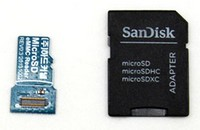

# Restauración del sistema inteligente Jeedom

## Copia de seguridad de Jeedom

En primer lugar, **Es imprescindible realizar una copia de seguridad de Jeedom** que se puede restaurar al final del procedimiento.

1. Vaya a la interfaz de Jeedom y luego haga clic en el menú **Configuración > Sistema > Copias de seguridad**.

2. Haga clic en el botón **Iniciar una copia de seguridad**.

3. Cuando se complete la copia de seguridad, haga clic en **Descargar copia de seguridad**.

4. Una vez descargada la copia de seguridad de Jeedom, apague el sistema usando el menú **Configuración > Sistema > Apagar**.

## Restauración del sistema por eMMC

El siguiente procedimiento explica cómo actualizar el entorno del sistema de Jeedom Smart box en **Diana de Debian 11**.

>**Importante**
>
>La restauración del sistema mediante una llave USB no se pudo mantener en este nuevo entorno, por lo que es necesario grabar el medio de almacenamiento interno directamente *(eMMC)* siguiendo los siguientes pasos.
>
>**Antes de comenzar, no dude en ver el vídeo de reemplazo de eMMC que detalla el desmontaje y montaje de la caja Jeedom Smart** *(2 minutos)* :
>
>{:objetivo="_en blanco"}

### Requisitos previos

Para actualizar el sistema es necesario :

- Equípate con'**un pequeño destornillador Phillips** para abrir la caja

---

- Adquirir [**una tarjeta eMMC de reemplazo**](https://www.domadoo.fr/fr/controleurs-adaptateurs/5539-jeedom-carte-memoire-emmc-16go-de-remplacement-pour-jeedom-smart.html){:objetivo="_en blanco"}

	**O**

- Descargar archivo [**JeedomSmart_Debian11.img.xz**](https://images.jeedom.com/smart/JeedomSmart_Debian11.img.xz)
- Equípate con'**un adaptador eMMC>USB/SD/μSD** para grabar la imagen desde una computadora, por ejemplo:

	

### Desmontaje de la caja Jeedom Smart

1. Desenchufe todos los dispositivos externos conectados al Smart *(alimentación, ethernet, USB, HDMI...)* y desenrosque la antena del controlador interno.

2. Desatornille los 2 tornillos en la parte frontal de la caja en la placa de plexiglás ***(Atención frágil !)***  :

	 

3. Deslice la placa base hacia la parte posterior de la caja :

	 

### Quemando el eMMC

1. Suelte el almacenamiento eMMC ubicado debajo de la placa base :

	 

>**INFORMACIÓN**
>
>Si reemplaza el eMMC original con un eMMC con Jeedom preinstalado en Debian 11, recorte el nuevo eMMC en lugar del anterior y luego vaya directamente al paso de [reensamblaje](#remontage-de-la-box-jeedom-smart).

2. Sujete el eMMC al adaptador y conéctelo a una computadora :

	 

3. Abra el software de grabación *(balenaEtcher por ejemplo)*.

4. Seleccione **el archivo JeedomSmart_Debian11.img.xz como fuente**, **Soporte eMMC como objetivo** entonces empieza a quemar.

5. Al final del grabado, desconecte el adaptador de la computadora, luego desenganche el eMMC y vuelva a engancharlo debajo de la placa base inteligente.

### Reensamblaje de la caja Jeedom Smart

1. Deslice la placa base de atrás hacia adelante a través de la carcasa.

2. Vuelva a colocar el plexiglás en su lugar y luego apriete los 2 tornillos en la parte frontal de la caja sin forzar.

3. Vuelva a atornillar la antena y luego vuelva a conectar los dispositivos externos, terminando con el cable de alimentación.

## Restaurar sistema mediante llave USB *(obsoleto)*

### Requisitos previos

Para actualizar el sistema es necesario :

- Equípate con'**una llave USB (mínimo 8 GB)**
- Descargar archivo [**backupJeedom.tar.gz**](https://images.jeedom.com/smart/backupJeedom.tar.gz)

### Restaurar vía USB

1. Copiar archivo **backupJeedom.tar.gz** en la memoria USB formateada en FAT32.

2. Desenchufe el cable de alimentación y luego conecte la llave USB al Smart.

3. Vuelva a conectar el cable de alimentación y espere aproximadamente 30 minutos *(la caja no debe reiniciarse durante la restauración del sistema)*.

4. Al finalizar el procedimiento vuelve a aparecer el cuadro en la red.

## Comenzando con el nuevo sistema

### Primer comienzo

En el primer inicio, el sistema de archivos cambia de tamaño para ocupar todo el espacio disponible antes de que el cuadro se reinicie automáticamente.

>**INFORMACIÓN**
>
>Este paso puede tardar hasta 2 minutos.

### Acceso a la aflicción

Una vez reinstalado el sistema, el primer acceso a la interfaz de Jeedom debe realizarse con las credenciales `admin`/`admin`.

### Restauración de la aflicción

1. Ir al menú **Configuración > Sistema > Copias de seguridad**.

2. Haga clic en **Agregar una copia de seguridad** y seleccione la copia de seguridad realizada anteriormente.

3. Haga clic en **Restaurar copia de seguridad**.

### Cambiar el puerto del controlador interno

**Bajo Debian 11 es necesario modificar el puerto del controlador interno** que ya no es `/dev/ttyS1` sino `/dev/ttyAML1` en este nuevo sistema.
