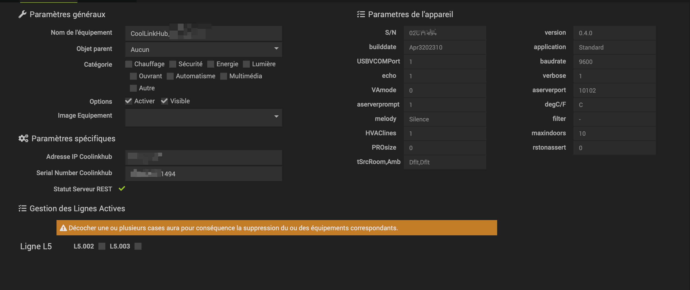

# Complemento CoolAutomation

# Descubrimiento automático de equipos CoolAutomation

Simplemente haga clic en Network Scan para comenzar a detectar equipos en su red

Una vez encontrado, se crearán los eqlogics correspondientes

# Detalle Equipo

La página de equipos reúne la información necesaria para la creación de equipos dependientes de este último

** Toda la información en esta página se actualiza al llegar a esta página.

En el lado derecho se encuentran los parámetros del equipo : versión de firmware, número máximo de líneas en el dispositivo, número máximo de unidades, etc.
Estos datos tienen finalidad meramente informativa y no pueden modificarse

En el lado izquierdo encontramos la dirección IP del equipo, así como su número de serie : Estos 2 datos son muy importantes porque se utilizan para enviar solicitudes a la API del dispositivo. 

Debajo de esta información encontramos el estado del Servidor REST : este es el servidor web del dispositivo, que se utiliza para comunicarse con el complemento. Por lo tanto, deberá activarlo si aún no lo está. 
Se puede activar a través del complemento, simplemente haciendo clic en el botón correspondiente

> ATTENTION

> Esto hará que el equipo se reinicie

Finalmente, en el apartado Gestión de Línea Activa encontrarás las unidades conectadas al equipo y disponibles para su creación.

# Cambiar imagen de equipo

Al ir al equipo de Cool Automation, puede elegir la imagen correspondiente y luego guardarla

# Creación de Unidades y su Equipo Maestro

Para crear el equipo que controla las unidades conectadas, simplemente márquelos en la sección Active Line Management y luego guarde

Esto creará los eqlogics correspondientes, así como el equipo Master, permitiéndole controlar una línea completa.

> ATTENTION

> Si desmarcas una unidad que ya ha sido creada y la guardas, esto eliminará el equipo. 
> Si se desmarcan todas las casillas de una línea, también se eliminarán los equipos Master de la línea

# Descripción general del equipo y sus unidades

# Asignar unidades a un objeto

Es posible que se hayan creado decenas de unidades, y resulta tedioso tener que ir a cada una para asignarles un objeto padre. 

Se ha proporcionado un sistema para facilitar esto : solo necesita marcar las unidades en una línea, luego hacer clic en Asignar selección a un objeto, para elegir el objeto principal al que se adjuntarán las unidades
Incluso puedes seleccionar todas las unidades a través de la casilla de verificación al lado del botón

# Actualización de datos 

Dependiendo de la configuración del complemento, los datos de todos los equipos se actualizarán con esta frecuencia

Existen otros 2 métodos para actualizar los datos de forma más específica, sin realizar una solicitud global para todos los dispositivos :

- haciendo clic en el icono Actualizar de un dispositivo Line Master : Los datos de sus unidades vinculadas serán recuperados
- haciendo clic en el icono Actualizar de un equipo hijo del Master : Sólo se recuperarán los datos de esta unidad

# Gestión de unidades y Másteres

Cada unidad se puede controlar individualmente

Para controlar todas las unidades de una línea, puede utilizar los comandos del Maestro asociado. 

> Para las instrucciones, estas están asociadas a un modo: Caliente o frío
> Un cambio de setpoint en un Master cambiará el setpoint de las unidades dependientes, pero también el modo asociado : Caliente o frío
> Así que recuerde restablecer el modo deseado una vez que se haya asignado el punto de ajuste general

