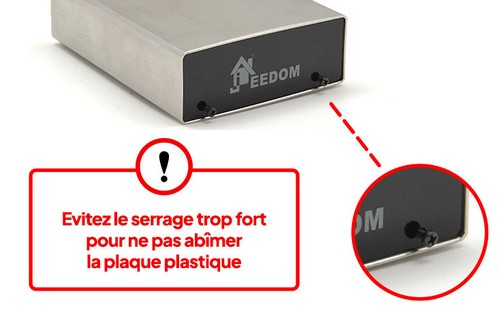

# Restauration système Jeedom Smart

## Sauvegarde de Jeedom

Avant toute chose, **il est indispensable de réaliser une sauvegarde de Jeedom** qui pourra être restaurée à l'issue de la procédure.

1. Se rendre sur l'interface Jeedom puis cliquer sur le menu **Réglages > Système > Sauvegardes**.

2. Cliquer sur le bouton **Lancer une sauvegarde**.

3. Quand la sauvegarde est terminée, cliquer sur **Télécharger la sauvegarde**.

4. Une fois la sauvegarde de Jeedom téléchargée, éteindre le système en passant par le menu **Réglages > Système > Eteindre**.

## Restauration système par eMMC

La procédure suivante explique comment mettre à jour l'environnement système de la box Jeedom Smart sous **Debian 11 Bullseye**.

>**IMPORTANT**
>
>La restauration système par clé USB n'a pu être maintenue sur ce nouvel environnement, il est donc nécessaire de graver directement le support de stockage interne *(eMMC)* en suivant les étapes suivantes.
>
>**Avant de vous lancer, n'hésitez surtout pas à visionner la vidéo de remplacement de l'eMMC  détaillant le démontage et le remontage de la box Jeedom Smart** *(2 minutes)* :
>
>

### Prérequis

Afin de réaliser la mise à jour du système, il faut :

- S'équiper d'**un petit tournevis cruciforme** pour ouvrir la box

---

- Acquérir [**une carte eMMC de remplacement**](https://www.domadoo.fr/fr/controleurs-adaptateurs/5539-jeedom-carte-memoire-emmc-16go-de-remplacement-pour-jeedom-smart.html){:target="_blank"}

	**OU**

- Télécharger le fichier [**JeedomSmart_Debian11.img.xz**](https://images.jeedom.com/smart/JeedomSmart_Debian11.img.xz)
- S'équiper d'**un adapteur eMMC>USB/SD/µSD** pour graver l'image depuis un ordinateur, par exemple:

	

### Démontage de la box Jeedom Smart

1. Débrancher tous les périphériques externes branchés sur la Smart *(alimentation, éthernet, USB, HDMI...)* et dévisser l'antenne du contrôleur interne.

2. Dévisser les 2 vis à l'avant de la box au niveau de la plaque en plexiglass ***(Attention fragile !)***  :

	 

3. Faire coulisser la carte mère vers l'arrière du boitier :

	 

### Gravure de l'eMMC

1. Déclipser le stockage eMMC situé sous la carte mère :

	 

>**INFORMATION**
>
>En cas de remplacement de l'eMMC d'origine par une eMMC avec Jeedom préinstallé sous Debian 11, clipser la nouvelle eMMC à la place de l'ancienne puis passer directement à l'étape de [remontage](#remontage-de-la-box-jeedom-smart).

2. Clipser l'eMMC sur l'adaptateur et le brancher sur un ordinateur :

	 

3. Ouvrir le logiciel de gravure *(balenaEtcher par exemple)*.

4. Sélectionner **le fichier JeedomSmart_Debian11.img.xz comme source**, **le support eMMC comme cible** puis démarrer la gravure.

5. A l'issue de la gravure, débrancher l'adapteur de l'ordinateur puis déclipser l'eMMC et la reclipser sous la carte mère de la Smart.

### Remontage de la box Jeedom Smart

1. Faire coulisser la carte mère de l'arrière vers l'avant à travers le boitier.

2. Remettre le plexiglass en place puis revisser les 2 vis à l'avant de la box sans forcer.

3. Revisser l'antenne puis rebrancher les périphériques externes en terminant par le câble d'alimentation.

## Restauration système par clé USB *(obsolète)*

### Prérequis

Afin de réaliser la mise à jour du système, il faut :

- S'équiper d'**une clé USB (minimum 8Go)**
- Télécharger le fichier [**backupJeedom.tar.gz**](https://images.jeedom.com/smart/backupJeedom.tar.gz)

### Restauration par USB

1. Copier le fichier **backupJeedom.tar.gz** sur la clé USB formatée en FAT32.

2. Débrancher le câble d'alimentation électrique puis brancher la clé USB sur la Smart.

3. Rebrancher le câble d'alimentation électrique et patienter environ 30 minutes *(la box ne doit pas être redémarrée durant la restauration système)*.

4. A l'issue de la procédure la box réapparait sur le réseau.

## Prise en main du nouveau système

### Premier démarrage

Au premier démarrage, le système de fichiers est redimensionné pour prendre tout l'espace disponible avant que la box ne redémarre automatiquement.

>**INFORMATION**
>
>Cette étape peut prendre jusqu'à 2 minutes.

### Accès à Jeedom

Le système ayant été réinstallé, le premier accès à l'interface Jeedom doit être réalisé avec les identifiants `admin`/`admin`.

### Restauration de Jeedom

1. Se rendre dans le menu **Réglages > Système > Sauvegardes**.

2. Cliquer sur **Ajouter une sauvegarde** et sélectionner la sauvegarde réalisée précédemment.

3. Cliquer sur **Restaurer la sauvegarde**.

### Modification du port du contrôleur interne

**Sous Debian 11 il est nécessaire de modifier le port du contrôleur interne** qui n'est plus `/dev/ttyS1` mais `/dev/ttyAML1` sur ce nouveau système.
